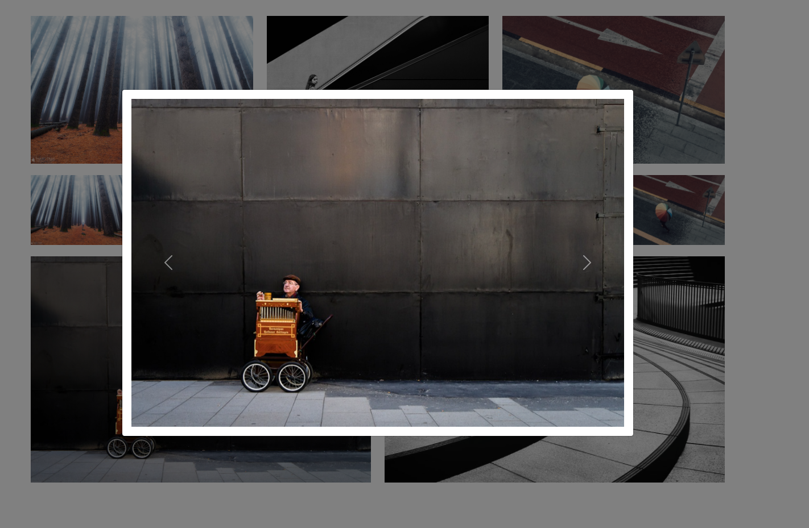

# Description

Get a nice lightbox with different options

# Installation

`npm i lightboxcrpozo`

Demo inside dist/index.html

Package Manager: npm
Transpiling: babel
Bundling: webpack

# Usage

```
   <div data-bs-toggle="lightbox">
        
        
    </div>

    <script src="./js/bundle.js"></script>
```

# Demo




# Options

* *interval_time* -  data-bs-interval="5000" (number/false stops the looping)
* *effect_type* - data-bs-ride="normal" (fade/normal)
* *arrow_mode* - data-bs-arrow="true" (true/false)
 